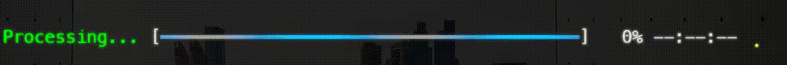

# DEXS.Console.FancyProgress

_[](https://www.nuget.org/packages/DEXS.Console.FancyProgress)_


A multi-targeted, emoji-aware, and highly customizable progress bar column library for [Spectre.Console](https://spectreconsole.net/). Supports .NET 8, 9, 10, and netstandard2.0. No third-party dependencies.



## Features
- Unicode and emoji support (grapheme-aware)
- Custom progress bar patterns (including emoji, Unicode, ASCII)
- Source generator for easy pattern extension
- Multi-targeted: net8.0, net9.0, net10.0, netstandard2.0
- No third-party dependencies

## Quick Start

Install via NuGet:

```
dotnet add package DEXS.Console.FancyProgress
```

## Basic Usage

```csharp
using Spectre.Console;
using DEXS.Console.FancyProgress;

AnsiConsole.Progress()
    .AutoClear(false)
    .Columns(
        new TaskDescriptionColumn(),
        new FancyProgressBarColumn
        {
            Width = 40,
            ProgressStyle = new Style(foreground: Color.Green),
            ProgressTailStyle = new Style(foreground: Color.Yellow4),
            CompletedStyle = new Style(foreground: Color.Lime),
            CompletedTailStyle = new Style(foreground: Color.Green),
            RemainingStyle = new Style(foreground: Color.Grey35),
            ProgressPattern = ProgressPattern.Known.Braille,
        },
        new PercentageColumn(),
        new RemainingTimeColumn(),
        new SpinnerColumn { Spinner = Spinner.Known.Dots12 }
    )
    .Start(ctx =>
    {
        var task = ctx.AddTask("[green1]Processing...[/]", maxValue: 100);
        while (!ctx.IsFinished)
        {
            task.Increment(1.5);
            Thread.Sleep(20);
        }
    });
```

## Gradient and Tail Style Support

You can enable a color gradient for the filled portion of the progress bar by setting both `ProgressStyle` and `ProgressTailStyle` (for in-progress) or `CompletedStyle` and `CompletedTailStyle` (for completed) on the `FancyProgressBarColumn`. The bar will smoothly blend from the start color to the tail color as progress increases.

**Example:**

```csharp
new FancyProgressBarColumn
{
    Width = 40,
    ProgressStyle = new Style(foreground: new Color(0, 255, 163)), // Start color
    ProgressTailStyle = new Style(foreground: new Color(177, 79, 255)), // End color (tail)
    CompletedStyle = new Style(foreground: Color.Lime),
    CompletedTailStyle = new Style(foreground: Color.Green),
    RemainingStyle = new Style(foreground: Color.Grey35),
    ProgressPattern = ProgressPattern.Known.UnicodeBar
}
```

**Properties:**

- `ProgressStyle`: The style (color) at the start of the filled bar (left side, in-progress).
- `ProgressTailStyle`: The style (color) at the end of the filled bar (right side, in-progress). Set the foreground to a color to enable the gradient.
- `CompletedStyle`: The style for the start of the bar when completed.
- `CompletedTailStyle`: The style for the end of the bar when completed.
- `RemainingStyle`: The style for the unfilled portion.

If `ProgressTailStyle.Foreground` or `CompletedTailStyle.Foreground` is set to `Color.Default`, no gradient is applied and the bar uses a solid color from the corresponding start style.

## All Built-in Patterns

```csharp
foreach (var pattern in ProgressPattern.Known.AllPatterns)
{
    AnsiConsole.WriteLine($"Pattern: {pattern.Name} - {string.Join("", pattern.Pattern)}");
}
```

## Using Custom Patterns at Runtime

You can define your own progress bar patterns at runtime by subclassing `ProgressPattern` directly in your application code—no need to edit the JSON or recompile the library. Example:

```csharp
using DEXS.Console.FancyProgress;

public class MyCustomPattern : ProgressPattern
{
    public override string Name => "My Custom";
    public override bool IsUnicode => true;
    public override bool IsCursor => false;
    public override IReadOnlyList<string> Pattern => new[] { 
        "░", 
        "█"
    };
}

// Usage:
var customPattern = new MyCustomPattern();

AnsiConsole.Progress()
    .Columns(
        new FancyProgressBarColumn { 
            ProgressPattern = customPattern 
        }
        // ... other columns ...
    )
    .Start(ctx => { /* ... */ });
```

---

## Custom Patterns (via Code Generator)

You can also add your own patterns by editing `progressPatterns.json` and rebuilding the project (requires recompiling the library).

## Documentation

See [docs/usage.md](docs/usage.md) for advanced usage, API details, and more examples, including custom patterns and advanced styling.

---

MIT License | Copyright (c) 2025 vic10us
